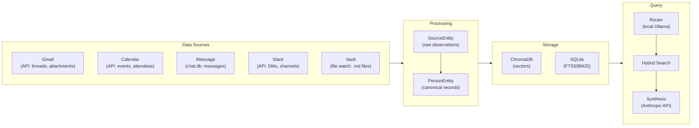
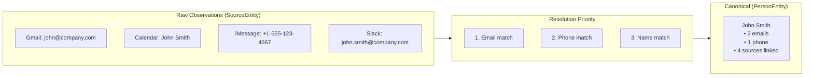
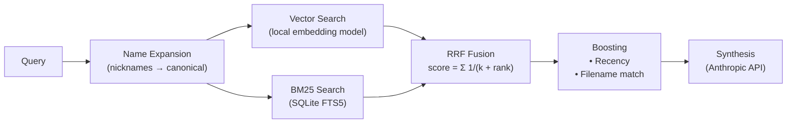
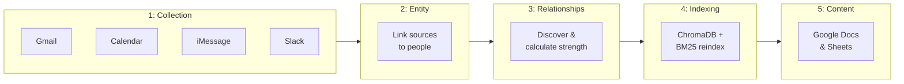
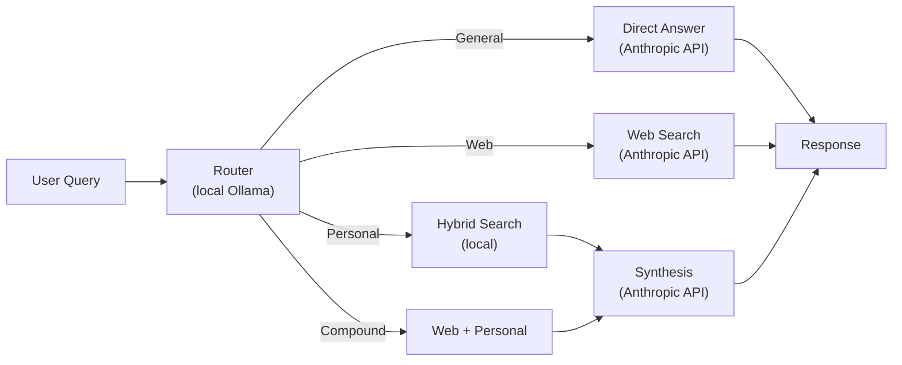
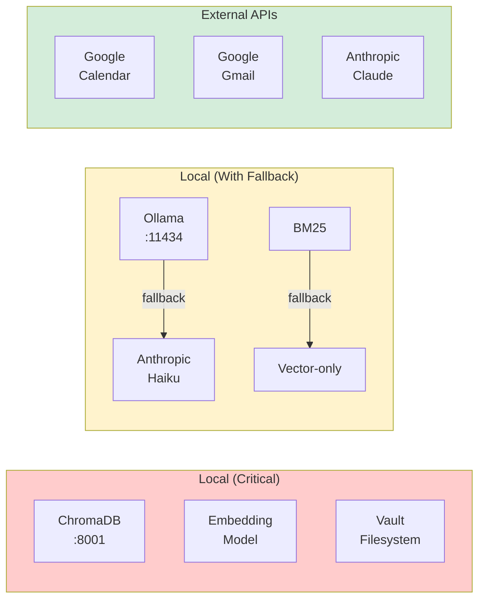

# LifeOS

Self-hosted AI assistant that indexes your digital life for semantic search and synthesis.

---

## Features

- **Semantic + keyword hybrid search** across Obsidian notes, emails, messages
- **Personal CRM** with entity resolution across all data sources
- **Task management** with Obsidian Tasks integration and natural language creation
- **Meeting prep briefings** with relevant context and history
- **People intelligence** - relationship tracking and network visualization
- **MCP server** for Claude Code integration
- **Local-first** - all data stays on your machine

---

## Quick Links

| Getting Started | Guides | Reference |
|-----------------|--------|-----------|
| [Installation](docs/getting-started/INSTALLATION.md) | [Google OAuth](docs/guides/GOOGLE-OAUTH.md) | [API Reference](docs/architecture/API-MCP-REFERENCE.md) |
| [Configuration](docs/getting-started/CONFIGURATION.md) | [Slack Integration](docs/guides/SLACK-INTEGRATION.md) | [Scripts](docs/reference/SCRIPTS.md) |
| [First Run](docs/getting-started/FIRST-RUN.md) | [Task Management](docs/guides/TASK-MANAGEMENT.md) | [Troubleshooting](docs/reference/TROUBLESHOOTING.md) |
|  | [Reminders](docs/guides/REMINDERS.md) | |
|  | [Launchd Setup](docs/guides/LAUNCHD-SETUP.md) | |

---

## Requirements

- **macOS** (required for Apple integrations)
- **Python 3.11+**
- **Anthropic API key**
- Obsidian vault (or other markdown notes)

---

## Quick Start

```bash
# 1. Clone and setup
git clone https://github.com/yourusername/LifeOS.git
cd LifeOS
python3 -m venv ~/.venvs/lifeos
source ~/.venvs/lifeos/bin/activate
pip install -r requirements.txt

# 2. Install Ollama
brew install ollama && ollama serve &
ollama pull qwen2.5:7b-instruct

# 3. Configure
cp .env.example .env
# Edit .env with your settings

# 4. Start services
./scripts/chromadb.sh start
./scripts/server.sh start

# 5. Open http://localhost:8000
```

See [Installation Guide](docs/getting-started/INSTALLATION.md) for detailed instructions.

---

## Architecture

> **Note**: Diagrams render on GitHub desktop. Mobile app shows raw code ([known limitation](https://github.com/orgs/community/discussions/11595)).


### How Data Flows

Data moves through LifeOS in a clear pipeline from sources to user-facing features:



### Two-Tier Entity Model

The CRM uses a two-tier model to handle data from multiple sources:



**Why two tiers?**
- **SourceEntity**: Preserves original data from each source (immutable audit trail)
- **PersonEntity**: Single unified record per person with merged data from all sources
- One person can have 50,000+ source entities across Gmail, Calendar, messages, etc.

### Search Pipeline

Queries go through a hybrid search combining semantic and keyword matching:



<details>
<summary><strong>Sync Phases (Daily 3AM)</strong></summary>

The unified daily sync runs in 5 phases with dependencies:



**Why phases matter:**
1. Data Collection must complete before Entity Processing can link records
2. Entity Processing must complete before Relationship Building has linked entities
3. Relationship Building must complete before Vector Indexing has fresh CRM data
4. Content Sync runs last (indexed on next cycle)

</details>

<details>
<summary><strong>Query Routing</strong></summary>

Different query types are handled by different pipelines:



**Query types:**
- **General knowledge**: "What's the capital of France?" → Claude answers directly
- **Web search**: "What's the weather in NYC?" → Uses web_search tool
- **Personal data**: "What did I discuss with John last week?" → Searches your data
- **Compound**: "Look up the trash schedule and remind me the night before" → Multiple actions

</details>

<details>
<summary><strong>Service Dependencies</strong></summary>

Services are categorized by criticality and fallback behavior:



**Severity levels:**
- **CRITICAL**: Sent immediately (ChromaDB down, embedding failed, vault inaccessible)
- **WARNING**: Batched nightly (Ollama unavailable, backup failed)
- **INFO**: Log only (Telegram retry, config defaults used)

</details>

---

## Data Sources

| Source | Method | Data |
|--------|--------|------|
| Obsidian | File watcher | Notes, mentions |
| Gmail | Google API | Emails, threads |
| Calendar | Google API | Events, attendees |
| iMessage | macOS chat.db | Messages |
| Slack | Slack API | DMs, users |
| Contacts | Apple CSV | Names, emails, phones |
| Photos | Photos.sqlite | Face recognition |
| LinkedIn | CSV import | Connections |

---

## Tech Stack

| Component | Technology |
|-----------|------------|
| Embeddings | sentence-transformers |
| Vector DB | ChromaDB |
| Keyword Search | SQLite FTS5 |
| Query Router | Ollama + Qwen 2.5 |
| Synthesis | Claude API |
| Backend | FastAPI |
| Frontend | Vanilla JS |

---

## Documentation

### Architecture
- [Data & Sync](docs/architecture/DATA-AND-SYNC.md) - Data sources and sync processes
- [API & MCP Reference](docs/architecture/API-MCP-REFERENCE.md) - API endpoints and MCP tools
- [Frontend](docs/architecture/FRONTEND.md) - UI components

### PRDs
- [Chat UI](docs/prd/CHAT-UI.md)
- [CRM UI](docs/prd/CRM-UI.md)
- [MCP Tools](docs/prd/MCP-TOOLS.md)

---

## Contributing

See [CONTRIBUTING.md](CONTRIBUTING.md) for guidelines.

---

## License

GNU General Public License v3.0 - see [LICENSE](LICENSE)
