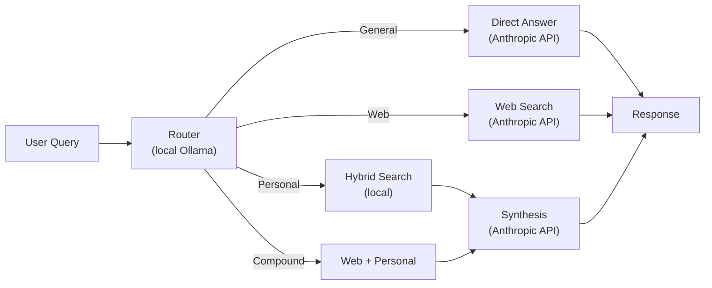
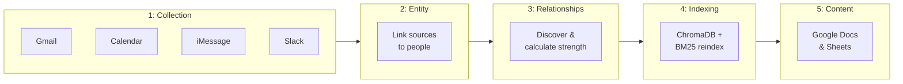
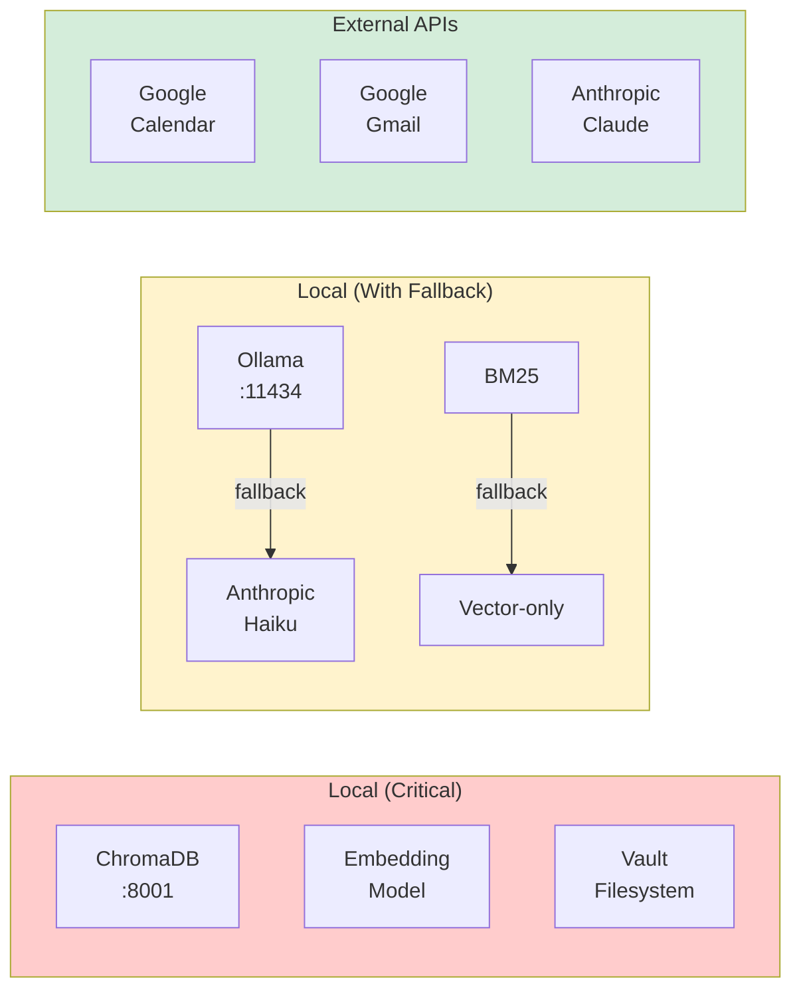

# LifeOS

**Your personal operating system, built from the digital exhaust of your life.**

LifeOS is a self-hosted AI assistant that connects to your Gmail, Google Calendar, iMessage, WhatsApp, Slack, Obsidian vault, Granola meeting transcriptions, Google Docs, iPhotos, LinkedIn, and Apple contacts — then makes all of it **available and actionable through natural language.** 

LifeOS is also able to take action in response to requests you send through Telegram: not just creating tasks and reminders, but reading/editing files on your computer and autonomously managing Claude Code to accomplish discrete tasks.

Everything runs locally on your Mac. Your data never leaves your machine — the Claude API is only used for discrete queries. A nightly sync pulls from your data sources, indexes everything for hybrid search (semantic + keyword), and keeps your knowledge graph fresh.

---

## What You Can Do

**Ask questions about your life – search across all the channels you use**: 
- Interface with it conversationally through Telegram, or a dedicated chat UI, or by using Claude Code to leverage the MCP tools directly
- "When did I last talk to Mom?" / "What's the context for my meeting with Acme Corp tomorrow?" and get quick answers and briefs
- "What were the key recommendations Sarah made on the Acme project last month?" will synthesize and answer from hybrid semantic + keyword search across notes, emails, messages, calendar, and more
- "What should I get Jane for her birthday" will pull context from up to 10 years of data to generate ideas tailored to her

**Manage and complete tasks** 
- "Remind me to follow up with John next Tuesday" creates a reminder (pushed to you through Telegram)
- "Tomorrow at 3pm, check that the sync completed as expected and shoot me a note to confirm it did" schedules a task and a push notification
- "Next Wednesday I need to pull down my 1099 from Schwab" creates a task in your task management system
- "I just saw an error in the sync, can you investigate and get it fixed?" will spin up and manage Claude Code to get things working again
- "Add an idea to that backlog markdown file in the X project folder - I want the system to be able to do Y" will find and directly edit the right file

**Track relationships**: 
- Visualize and explore your relationships with each person in your life through a CRM UI
- Track and analyze your relationships with those closest to you, like family and a designated partner
- Ask "Who am I engaging with less than I used to? Who should I reconnect with?" and see interaction history, communication patterns, and relationship strength over time

You can also interface with it for general queries in the same way you'd interact with any AI model, and it'll intelligently route the query to Opus, Google, your personal data, etc.

---

## Quick Links

| Getting Started | Guides | Reference |
|-----------------|--------|-----------|
| [Installation](docs/getting-started/INSTALLATION.md) | [Google OAuth](docs/guides/GOOGLE-OAUTH.md) | [API Reference](docs/architecture/API-MCP-REFERENCE.md) |
| [Configuration](docs/getting-started/CONFIGURATION.md) | [Slack Integration](docs/guides/SLACK-INTEGRATION.md) | [Scripts](docs/reference/SCRIPTS.md) |
| [First Run](docs/getting-started/FIRST-RUN.md) | [Task Management](docs/guides/TASK-MANAGEMENT.md) | [Troubleshooting](docs/reference/TROUBLESHOOTING.md) |
|  | [Reminders](docs/guides/REMINDERS.md) | |
|  | [Launchd Setup](docs/guides/LAUNCHD-SETUP.md) | |

---

## Requirements

- **macOS** (required for Apple integrations)
- **Python 3.11+**
- **Anthropic API key**
- Obsidian vault (or other markdown notes)

---

## Quick Start

```bash
# 1. Clone and setup
git clone https://github.com/yourusername/LifeOS.git
cd LifeOS
python3 -m venv ~/.venvs/lifeos
source ~/.venvs/lifeos/bin/activate
pip install -r requirements.txt

# 2. Install Ollama
brew install ollama && ollama serve &
ollama pull qwen2.5:7b-instruct

# 3. Configure
cp .env.example .env
# Edit .env with your settings

# 4. Start services
./scripts/chromadb.sh start
./scripts/server.sh start

# 5. Open http://localhost:8000
```

See [Installation Guide](docs/getting-started/INSTALLATION.md) for detailed instructions.

---

## Architecture


### Search Pipeline

Different query types are handled by different pipelines:



**Query types:**
- **General knowledge**: "What's the capital of France?" → Claude answers directly
- **Web search**: "What's the weather in NYC?" → Uses web_search tool
- **Personal data**: "What did I discuss with John last week?" → Searches your data
- **Compound**: "Look up the trash schedule and remind me the night before" → Multiple actions

### CRM UI

Translates 10 years of interaction history with thousands of contacts into insights and visualizations.

<strong>Pages aggregating contact details and interaction history for each person you know.</strong>


<strong>Visualize how your communication patterns have evolved over the last 10 years.</strong>


<strong>Dive deeper on relationships with your family and partner.</strong>


<strong>Visualize and explore relationships in a dynamic social graph.</strong>


---

## Data Sources

| Source | Method | Data |
|--------|--------|------|
| Obsidian | File watcher | Notes, mentions |
| Gmail | Google API | Emails, threads |
| Calendar | Google API | Events, attendees |
| iMessage | macOS chat.db | Messages |
| Slack | Slack API | DMs, users |
| Contacts | Apple CSV | Names, emails, phones |
| Photos | Photos.sqlite | Face recognition |
| LinkedIn | CSV import | Connections |

<details>
<summary><strong>Sync Phases (Daily 3AM)</strong></summary>

The unified daily sync runs in 5 phases with dependencies:



**Why:**
1. Data Collection must complete before Entity Processing can link records
2. Entity Processing must complete before Relationship Building has linked entities
3. Relationship Building must complete before Vector Indexing has fresh CRM data
4. Content Sync runs last (indexed on next cycle)

</details>

<details>
<summary><strong>Service Dependencies</strong></summary>

Services are categorized by criticality and fallback behavior:



**Severity levels:**
- **CRITICAL**: Sent immediately (ChromaDB down, embedding failed, vault inaccessible)
- **WARNING**: Batched nightly (Ollama unavailable, backup failed)
- **INFO**: Log only (Telegram retry, config defaults used)

</details>

---

## Tech Stack

| Component | Technology |
|-----------|------------|
| Embeddings | sentence-transformers |
| Vector DB | ChromaDB |
| Keyword Search | SQLite FTS5 |
| Query Router | Ollama + Qwen 2.5 |
| Synthesis | Claude API |
| Backend | FastAPI |
| Frontend | Vanilla JS |

---

## Documentation

### Architecture
- [Data & Sync](docs/architecture/DATA-AND-SYNC.md) - Data sources and sync processes
- [API & MCP Reference](docs/architecture/API-MCP-REFERENCE.md) - API endpoints and MCP tools
- [Frontend](docs/architecture/FRONTEND.md) - UI components

### PRDs
- [Chat UI](docs/prd/CHAT-UI.md)
- [CRM UI](docs/prd/CRM-UI.md)
- [MCP Tools](docs/prd/MCP-TOOLS.md)

---

## Contributing

See [CONTRIBUTING.md](CONTRIBUTING.md) for guidelines.

---

## License

GNU General Public License v3.0 - see [LICENSE](LICENSE)
