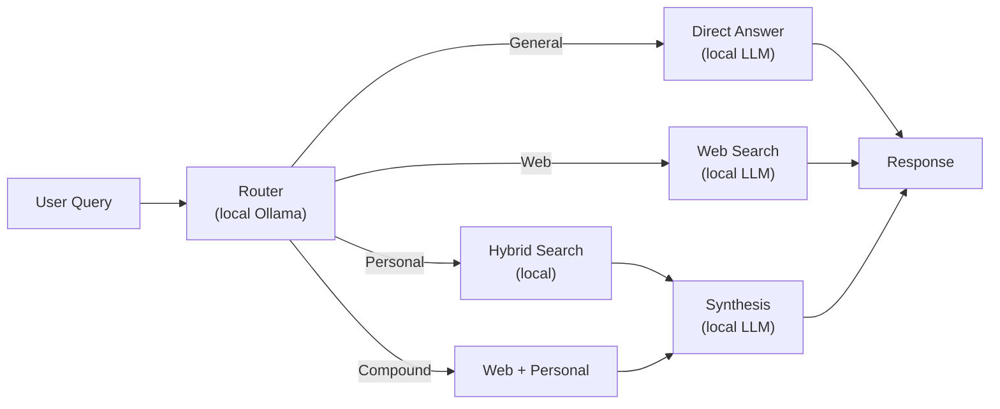
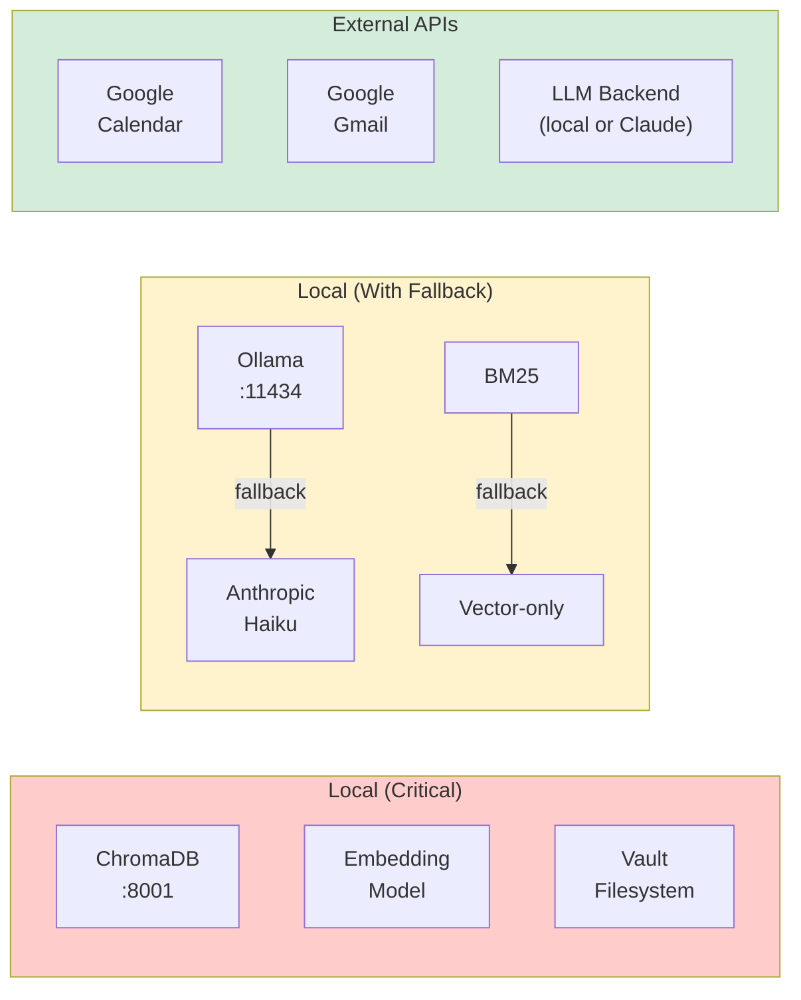

# LifeOS

**Your personal operating system, built from the digital exhaust of your life.**

LifeOS is a self-hosted AI assistant that connects to your Gmail, Google Calendar, iMessage, WhatsApp, Slack, Obsidian vault, Granola meeting transcriptions, Google Docs, iPhotos, LinkedIn, and Apple contacts — then makes all of it **available and actionable through natural language.**

LifeOS is also able to take action in response to requests you send through Telegram: not just creating tasks and reminders, but reading/editing files on your computer and autonomously managing Claude Code to accomplish discrete tasks.

Everything runs locally. Your data never leaves your machine — a local LLM handles orchestration and synthesis by default (Claude API is available as an optional backend). A nightly sync pulls from your data sources, indexes everything for hybrid search (semantic + keyword), and keeps your knowledge graph fresh.

---

## What You Can Do

**Ask questions about your life – search across all the channels you use**:
- Interface with it conversationally through Telegram, or a dedicated chat UI, or by using Claude Desktop / Claude Code to leverage the MCP tools directly
- "When did I last talk to Mom?" / "What's the context for my meeting with Acme Corp tomorrow?" and get quick answers and briefs
- "What were the key recommendations Sarah made on the Acme project last month?" will synthesize and answer from hybrid semantic + keyword search across notes, emails, messages, calendar, and more
- "What should I get Jane for her birthday" will pull context from up to 10 years of data to generate ideas tailored to her

**Manage and complete tasks**
- "Remind me to follow up with John next Tuesday" creates a reminder (pushed to you through Telegram)
- "Tomorrow at 3pm, check that the sync completed as expected and shoot me a note to confirm it did" schedules a task and a push notification
- "Next Wednesday I need to pull down my 1099 from Schwab" creates a task in your task management system
- "I just saw an error in the sync, can you investigate and get it fixed?" will spin up and manage Claude Code to get things working again
- "Add an idea to that backlog markdown file in the X project folder - I want the system to be able to do Y" will find and directly edit the right file

**Proactive intelligence** — the system doesn't just wait for you to ask:
- Before meetings, it checks your calendar and pushes a prep briefing with attendee context from your CRM
- Each morning, it summarizes your day: calendar, tasks, important emails
- Weekly, it reviews who you haven't been in touch with and nudges you
- If there's nothing to report, it stays quiet — no noise

**Track relationships**:
- Visualize and explore your relationships with each person in your life through a CRM UI
- Track and analyze your relationships with those closest to you, like family and a designated partner
- Ask "Who am I engaging with less than I used to? Who should I reconnect with?" and see interaction history, communication patterns, and relationship strength over time

The assistant also remembers context you share with it across conversations — preferences, facts about people, things you've told it — and uses that context to give better answers over time.

You can also interface with it for general queries in the same way you'd interact with any AI model, and it'll intelligently route the query to Opus, Google, your personal data, etc.

---

## Quick Links

| Getting Started | Guides | Reference |
|-----------------|--------|-----------|
| [Installation](docs/guides/installation.md) | [Google OAuth](docs/guides/google-oauth.md) | [API Reference](docs/specs/product/api-reference.md) |
| [Configuration](docs/guides/configuration.md) | [Slack Integration](docs/guides/slack-integration.md) | [Scripts](docs/guides/scripts.md) |
| [First Run](docs/guides/first-run.md) | [Task Management](docs/specs/product/task-management.md) | [Troubleshooting](docs/guides/troubleshooting.md) |
|  | [Reminders](docs/guides/reminders.md) | |
|  | [Launchd Setup](docs/guides/launchd-setup.md) (macOS) | |

---

## Requirements

- **Linux** (primary) or **macOS**
- **Python 3.11+**
- **GPU recommended** for local LLM and embedding model (AMD ROCm or NVIDIA CUDA)
- Obsidian vault (or other markdown notes)

macOS is only required if you want native Apple integrations (iMessage, Contacts, Photos). A Mac can also act as an Apple Data Agent satellite, exporting Apple data nightly to a Linux server.

### LLM Options

LifeOS uses a local LLM by default for orchestration and synthesis — no API key needed. The model size is configurable based on your hardware:

| Hardware | Recommended Model | Config |
|----------|------------------|--------|
| 8 GB RAM | Small model (e.g., 7B params) | `LIFEOS_LLM_BACKEND=local` |
| 16–32 GB RAM | Medium model (e.g., 14–32B params) | `LIFEOS_LLM_BACKEND=local` |
| 64 GB+ VRAM | Large model (e.g., 70–120B params) | `LIFEOS_LLM_BACKEND=local` |
| No GPU / prefer cloud | Claude API | `LIFEOS_LLM_BACKEND=anthropic` + API key |

Set `LIFEOS_LLM_BACKEND=anthropic` and provide an `ANTHROPIC_API_KEY` in `.env` to use the Claude API instead of a local model. See the [Configuration Guide](docs/guides/configuration.md) for details.

---

## Quick Start

```bash
# 1. Clone and setup
git clone https://github.com/nbramia/LifeOS.git
cd LifeOS
python3 -m venv ~/.venvs/lifeos
source ~/.venvs/lifeos/bin/activate
pip install -r requirements.txt

# 2. Install Ollama (for query routing)
# Linux:
curl -fsSL https://ollama.com/install.sh | sh
# macOS:
brew install ollama

ollama serve &
ollama pull qwen2.5:7b-instruct

# 3. Configure
cp .env.example .env
# Edit .env with your settings (LIFEOS_VAULT_PATH at minimum)

# 4. Start services
./scripts/server.sh start

# 5. Open http://localhost:8000
```

For persistent services on Linux, run `sudo ./scripts/setup-systemd.sh` to install systemd units.

See [Installation Guide](docs/guides/installation.md) for detailed instructions.

---

## Architecture


### Search Pipeline

Different query types are handled by different pipelines:


```mermaid
flowchart LR
    Q["User Query"] --> Router["Router\n(local Ollama)"]

    Router -->|"General"| Direct["Direct Answer\n(local LLM)"]
    Router -->|"Web"| Web["Web Search\n(local LLM)"]
    Router -->|"Personal"| Hybrid["Hybrid Search\n(local)"]
    Router -->|"Compound"| Both["Web + Personal"]

    Hybrid --> Syn["Synthesis\n(local LLM)"]
    Both --> Syn
    Direct --> Response["Response"]
    Web --> Response
    Syn --> Response
```

**Query types:**
- **General knowledge**: "What's the capital of France?" → LLM answers directly
- **Web search**: "What's the weather in NYC?" → Uses web_search tool
- **Personal data**: "What did I discuss with John last week?" → Searches your data
- **Compound**: "Look up the trash schedule and remind me the night before" → Multiple actions

### CRM UI

Translates 10 years of interaction history with thousands of contacts into insights and visualizations.

<strong>Pages aggregating contact details and interaction history for each person you know.</strong>


<strong>Visualize how your communication patterns have evolved over the last 10 years.</strong>


<strong>Dive deeper on relationships with your family and partner.</strong>


<strong>Visualize and explore relationships in a dynamic social graph.</strong>


---

## Data Sources

| Source | Method | Data |
|--------|--------|------|
| Obsidian | File watcher | Notes, mentions |
| Gmail | Google API | Emails, threads |
| Calendar | Google API | Events, attendees |
| iMessage | Apple Data Agent | Messages |
| Slack | Slack API | DMs, users |
| Contacts | Apple Data Agent | Names, emails, phones |
| Photos | Apple Data Agent | Face recognition |
| WhatsApp | wacli | Chat history |
| LinkedIn | CSV import | Connections |
| Monarch | API | Financial data |

<details>
<summary><strong>Sync Phases (Daily 3:30 AM)</strong></summary>

The unified daily sync runs in 7 phases with dependencies:


```mermaid
flowchart LR
    subgraph P1["1: Collection"]
        direction TB
        G1[Gmail]
        C1[Calendar]
        IM[iMessage]
        Sl[Slack]
    end

    subgraph P2["2: Entity"]
        direction TB
        Link["Link sources\nto people"]
    end

    subgraph P3["3: Relationships"]
        direction TB
        Rel["Discover &\ncalculate strength"]
    end

    subgraph P4["4: Indexing"]
        direction TB
        Idx["ChromaDB +\nBM25 reindex"]
    end

    subgraph P5["5: Content"]
        direction TB
        Con["Google Docs\n& Sheets"]
    end

    subgraph P6["6: Cleanup"]
        direction TB
        Clean["Entity cleanup\n& dedup"]
    end

    subgraph P7["7: Verify"]
        direction TB
        Ver["Consistency\nchecks"]
    end

    P1 --> P2 --> P3 --> P4 --> P5 --> P6 --> P7
```

**Why:**
1. Data Collection must complete before Entity Processing can link records
2. Entity Processing must complete before Relationship Building has linked entities
3. Relationship Building must complete before Vector Indexing has fresh CRM data
4. Content Sync runs last (indexed on next cycle)
5. Entity Cleanup auto-hides non-humans and queues duplicates for review
6. Consistency Verification checks orphaned records, stale merged IDs, and stats mismatches

</details>

<details>
<summary><strong>Service Dependencies</strong></summary>

Services are categorized by criticality and fallback behavior:


```mermaid
flowchart LR
    subgraph Local["Local (Critical)"]
        direction TB
        ChromaDB["ChromaDB\n:8001"]
        Embed["Embedding\nModel"]
        Vault["Vault\nFilesystem"]
    end

    subgraph Fallback["Local (With Fallback)"]
        direction TB
        Ollama["Ollama\n:11434"] -->|fallback| Haiku["Anthropic\nHaiku"]
        BM25["BM25"] -->|fallback| VecOnly["Vector-only"]
    end

    subgraph External["External APIs"]
        direction TB
        GCal["Google\nCalendar"]
        Gmail["Google\nGmail"]
        LLM["LLM Backend\n(local or Claude)"]
    end

    style Local fill:#ffcccc
    style Fallback fill:#fff3cd
    style External fill:#d4edda
```

**Severity levels:**
- **CRITICAL**: Sent immediately (ChromaDB down, embedding failed, vault inaccessible)
- **WARNING**: Batched nightly (Ollama unavailable, backup failed)
- **INFO**: Log only (Telegram retry, config defaults used)

</details>

---

## Tech Stack

| Component | Technology |
|-----------|------------|
| Backend | FastAPI (port 8000) |
| LLM (orchestration + synthesis) | Local model via llama.cpp, or Claude API |
| Embeddings | sentence-transformers (gte-Qwen2-1.5B-instruct) |
| Vector DB | ChromaDB (port 8001) |
| Keyword Search | SQLite FTS5 (BM25) |
| Query Router | Ollama + Qwen 2.5 |
| Frontend | Vanilla HTML/JS (no build step) |
| Job Queue | SQLite (background reindex, sync) |
| Reminders | SQLite + cron scheduler |
| Service Management | systemd (Linux) / launchd (macOS) |
| GPU Acceleration | ROCm (AMD) or CUDA (NVIDIA) |

---

## Documentation

### Specifications
- [Data Model](docs/specs/product/data-model.md) - Two-tier entity model and relationships
- [API Reference](docs/specs/product/api-reference.md) - API endpoints and MCP tools
- [Data & Sync](docs/specs/technical/data-and-sync.md) - Sync pipeline and data sources
- [Search & Indexing](docs/specs/technical/search-indexing.md) - Hybrid search internals
- [Frontend](docs/specs/technical/frontend.md) - UI components

### Product
- [Chat UI](docs/specs/product/chat-ui.md)
- [CRM UI](docs/specs/product/crm-ui.md)
- [MCP Tools](docs/specs/product/mcp-tools.md)

### Architecture Decisions
- [ADR Index](docs/adr/) - Why we chose Python/FastAPI, ChromaDB, hybrid search, and more

---

## Contributing

See [CONTRIBUTING.md](CONTRIBUTING.md) for guidelines.

---

## License

GNU General Public License v3.0 - see [LICENSE](LICENSE)
