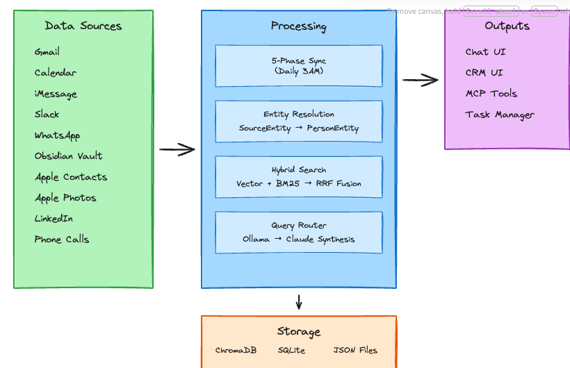
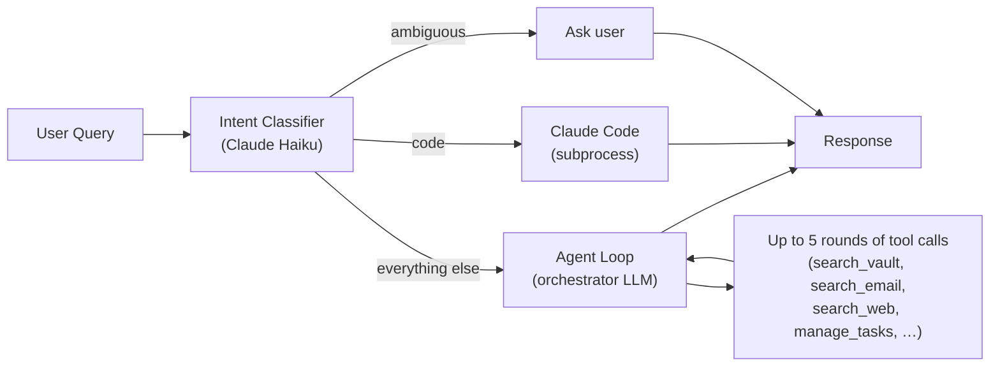
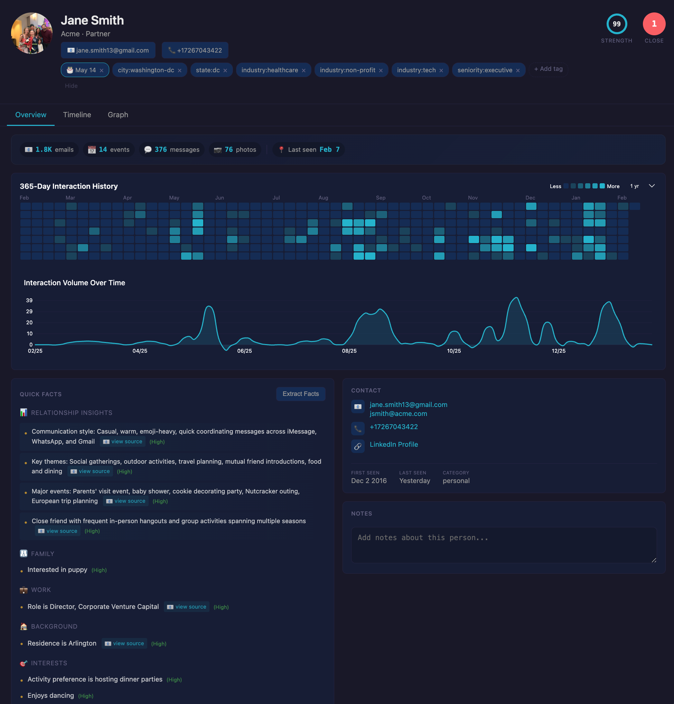
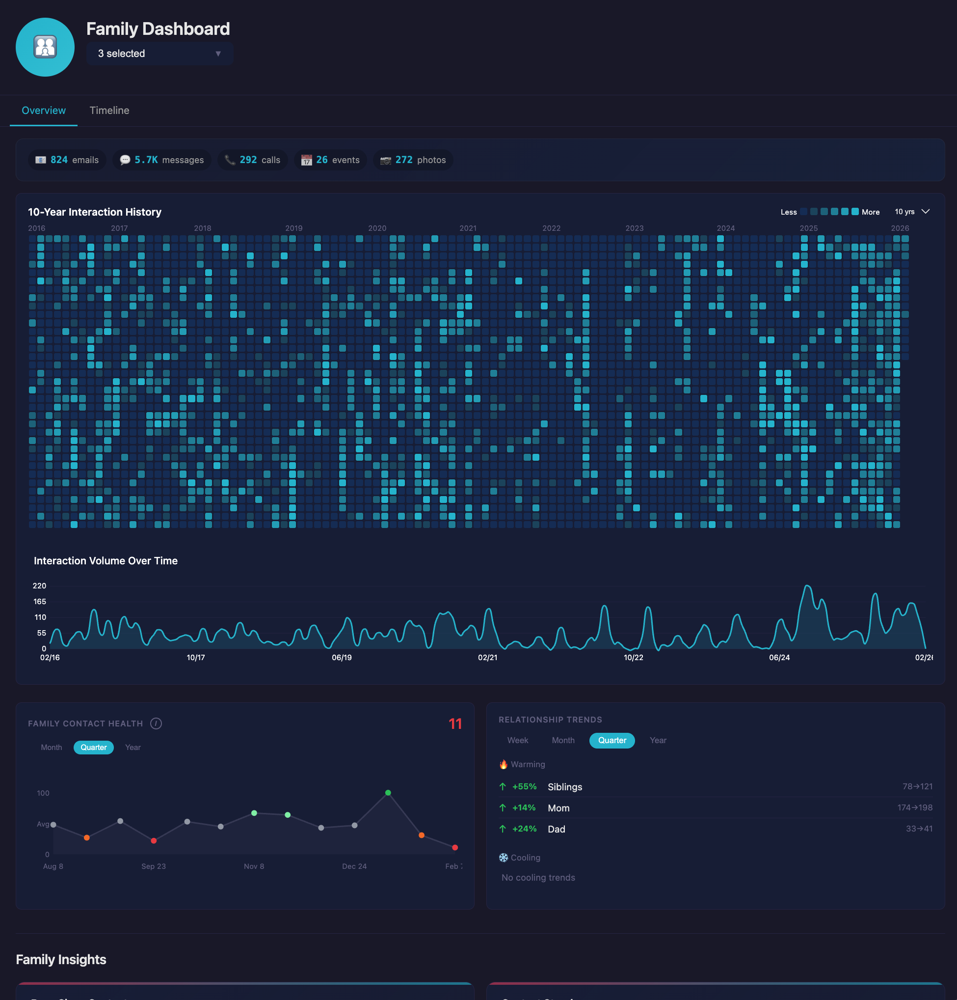
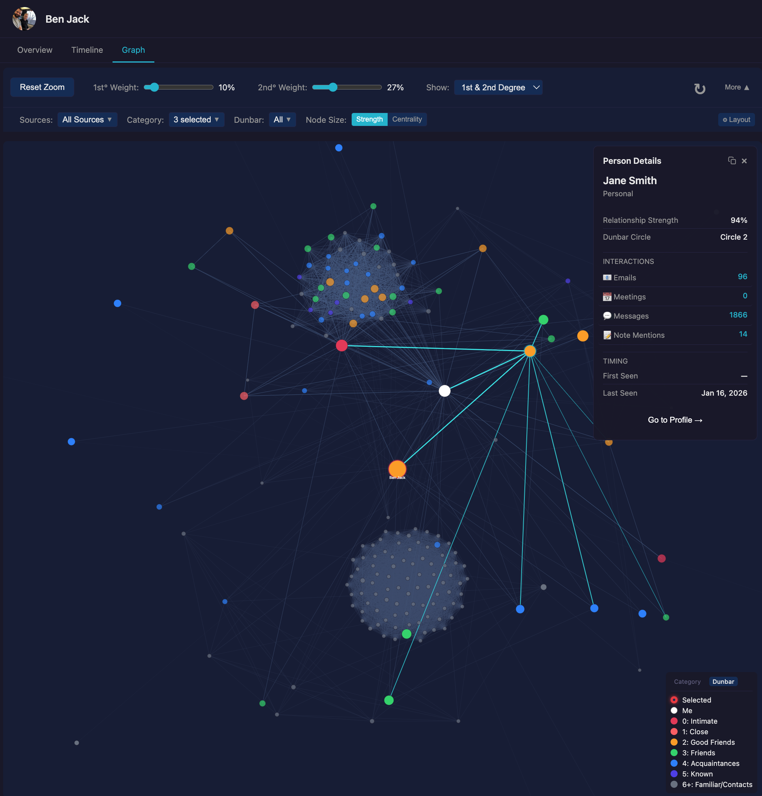
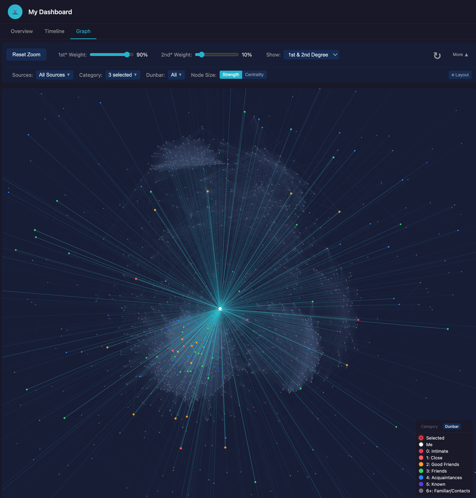
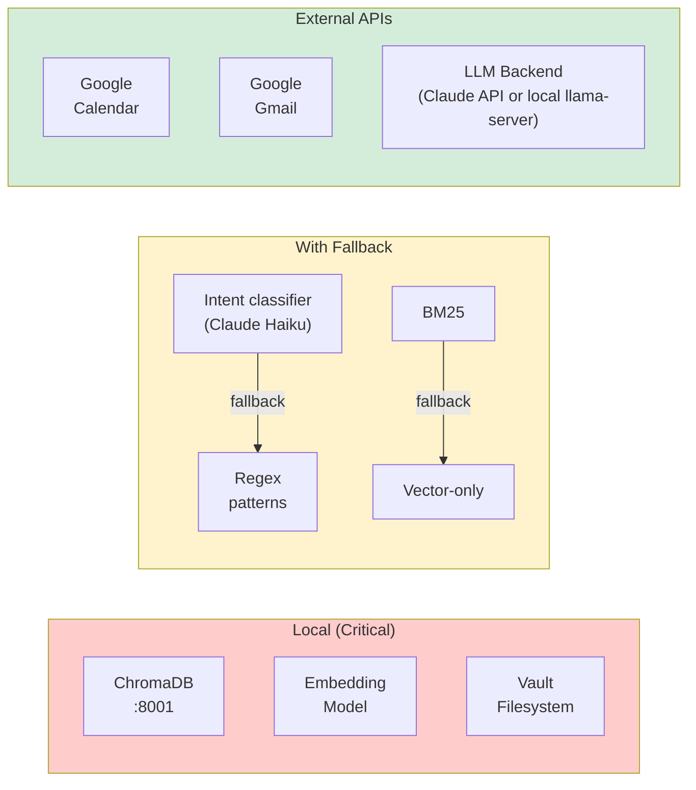

# LifeOS

**Your personal operating system, built from the digital exhaust of your life.**

LifeOS is a self-hosted AI assistant that connects to your Gmail, Google Calendar, iMessage, WhatsApp, Slack, Obsidian vault, Granola meeting transcriptions, Google Docs, iPhotos, LinkedIn, and Apple contacts — then makes all of it **available and actionable through natural language.**

LifeOS is also able to take action in response to requests you send through Telegram: not just creating tasks and reminders, but reading/editing files on your computer and autonomously managing Claude Code to accomplish discrete tasks.

All of your data is indexed and stored locally — your vault, messages, photos, financial summaries, and the like never leave your machine. By default, orchestration and synthesis call the Claude API (`LIFEOS_LLM_BACKEND=anthropic`, the default), which sends the current query and its retrieved context to Anthropic; set `LIFEOS_LLM_BACKEND=local` to route everything through a local llama-server instead. A nightly sync pulls from your data sources, indexes everything for hybrid search (semantic + keyword), and keeps your knowledge graph fresh.

---

## What You Can Do

**Ask questions about your life – search across all the channels you use**:
- Interface with it conversationally through Telegram, or a dedicated chat UI, or by using Claude Desktop / Claude Code to leverage the MCP tools directly
- "When did I last talk to Mom?" / "What's the context for my meeting with Acme Corp tomorrow?" and get quick answers and briefs
- "What were the key recommendations Sarah made on the Acme project last month?" will synthesize and answer from hybrid semantic + keyword search across notes, emails, messages, calendar, and more
- "What should I get Jane for her birthday" will pull context from up to 10 years of data to generate ideas tailored to her

**Manage and complete tasks**
- "Remind me to follow up with John next Tuesday" creates a reminder (pushed to you through Telegram)
- "Tomorrow at 3pm, check that the sync completed as expected and shoot me a note to confirm it did" schedules a task and a push notification
- "Next Wednesday I need to pull down my 1099 from Schwab" creates a task in your task management system
- "I just saw an error in the sync, can you investigate and get it fixed?" will spin up and manage Claude Code to get things working again
- "Add an idea to that backlog markdown file in the X project folder - I want the system to be able to do Y" will find and directly edit the right file

**Proactive intelligence** — the system doesn't just wait for you to ask:
- Before meetings, it checks your calendar and pushes a prep briefing with attendee context from your CRM
- Each morning, it summarizes your day: calendar, tasks, important emails
- Weekly, it reviews who you haven't been in touch with and nudges you
- If there's nothing to report, it stays quiet — no noise

**Track relationships**:
- Visualize and explore your relationships with each person in your life through a CRM UI
- Track and analyze your relationships with those closest to you, like family and a designated partner
- Ask "Who am I engaging with less than I used to? Who should I reconnect with?" and see interaction history, communication patterns, and relationship strength over time

The assistant also remembers context you share with it across conversations — preferences, facts about people, things you've told it — and uses that context to give better answers over time.

You can also interface with it for general queries in the same way you'd interact with any AI model, and it'll intelligently route the query to Opus, Google, your personal data, etc.

---

## Hand Off Tasks to an Autonomous Agent

LifeOS includes an external **agent worker** that picks up tasks you've tagged `#agent` and completes them end-to-end while you're doing something else. Add a line to your task list and walk away — the agent runs it, completes it, marks the task done in your vault, and pings you on Telegram with the result.

```
- [ ] TODO Summarize my unread emails from the partnership channel and reply with the top 3 by importance #agent
- [ ] TODO Find every meeting where we discussed the Q3 launch and list attendees #agent #local
- [ ] TODO Draft a follow-up to last week's intro with Acme. Budget $0.25 #agent
```

What you get:

- **Hands-free completion.** Tag a task and forget it. Telegram tells you when it's done, what it did, and what it cost.
- **Choose your model.** `#local` routes to your self-hosted Gemma — free, private, fast on workstation-class GPUs. `#cloud` routes to Anthropic's Claude on Managed Agents — slower per-token but pairs with Gmail / Calendar / Drive / Slack / Asana / Ramp connectors out of the box. No tag and the agent infers from the title: tasks that obviously need cloud connectors ("draft an email", "check my calendar") route to Claude; everything else can run locally.
- **Budgets you can put in the title.** "max $0.50", "5 min", "10k tokens" — parsed in natural language by a tiny preflight pass. Daily and per-task caps enforced from outside the agent loop, so the model can't override them. There's a global daily $-ceiling backstop.
- **Asks for help when stuck.** Genuinely ambiguous tasks ("reply to Alex") get pushed to Telegram with one targeted question. Reply with Telegram's reply feature and the agent resumes. If you don't answer within 72 hours (configurable), the task is parked and you get a heads-up.
- **Spawns its own teammates.** Agents can spawn child sessions (`lifeos_agent_spawn`), message them, and yield until they finish — preferred over polling, because yielding ends the session cleanly (no idle billing on cloud) and resumes automatically when children complete. Useful for fan-out research, multi-step pipelines, "go do X and Y in parallel" workflows.
- **Full audit trail.** Every tool call, every model turn, every cost delta lands in `data/agent_transcripts/<session_id>.jsonl`. Telegram completion summaries point at it if anything looks off.
- **Restart-safe.** The worker is signal-clean. Crash mid-task and the next start rolls non-terminal sessions back to `#agent` for retry, or resumes any cloud sessions that are still running on Anthropic's side.

Set up: [Agent Worker Setup](docs/guides/agent-worker-setup.md). Full reference: [Product](docs/specs/product/agent-worker.md) · [Technical](docs/specs/technical/agent-worker.md).

---

## Quick Links

| Getting Started | Guides | Reference |
|-----------------|--------|-----------|
| [Installation](docs/guides/installation.md) | [Google OAuth](docs/guides/google-oauth.md) | [API Reference](docs/specs/product/api-reference.md) |
| [Configuration](docs/guides/configuration.md) | [Slack Integration](docs/guides/slack-integration.md) | [Scripts](docs/guides/scripts.md) |
| [First Run](docs/guides/first-run.md) | [Task Management](docs/specs/product/task-management.md) | [Troubleshooting](docs/guides/troubleshooting.md) |
|  | [Reminders](docs/guides/reminders.md) | [Agent Worker](docs/specs/product/agent-worker.md) |
|  | [Launchd Setup](docs/guides/launchd-setup.md) (macOS) | |
|  | [Agent Worker Setup](docs/guides/agent-worker-setup.md) | |

---

## Requirements

- **Linux** (primary) or **macOS**
- **Python 3.11+**
- **GPU recommended** for local LLM and embedding model (AMD ROCm or NVIDIA CUDA)
- Obsidian vault (or other markdown notes)

macOS is only required if you want native Apple integrations (iMessage, Contacts, Photos). A Mac can also act as an Apple Data Agent satellite, exporting Apple data nightly to a Linux server.

### LLM Options

Orchestration and synthesis can run against the Claude API (default) or a local OpenAI-compatible llama-server. Pick what matches your hardware and privacy posture:

| Hardware / preference | Config | Notes |
|----------------------|--------|-------|
| No GPU / prefer cloud (default) | `LIFEOS_LLM_BACKEND=anthropic` + `ANTHROPIC_API_KEY` | Default model: `claude-haiku-4-5`. Override via `LIFEOS_ANTHROPIC_MODEL`. Query text + retrieved context is sent to Anthropic. |
| 8 GB RAM | `LIFEOS_LLM_BACKEND=local` + small llama-server model (~7B params) | Set `LIFEOS_LOCAL_LLM_URL` if not on localhost:8080. |
| 16–32 GB RAM | `LIFEOS_LLM_BACKEND=local` + medium model (~14–32B params) | |
| 64 GB+ VRAM | `LIFEOS_LLM_BACKEND=local` + large model (70–120B params) | |

To stay fully local, set `LIFEOS_LLM_BACKEND=local` and point `LIFEOS_LOCAL_LLM_URL` at a running llama-server. See the [Configuration Guide](docs/guides/configuration.md) for details.

`LIFEOS_ANTHROPIC_MODEL` is the single orchestrator-model knob: every chat round, every intent-classification call, and every per-tool synthesis hop uses it. There is no per-query model tiering today — if you want a heavier model for harder questions, set it here and it applies to all traffic.

---

## Quick Start

```bash
# 1. Clone and setup
git clone https://github.com/yourusername/LifeOS.git
cd LifeOS
python3 -m venv ~/.venvs/lifeos
source ~/.venvs/lifeos/bin/activate
pip install -r requirements.txt

# 2. Configure
cp .env.example .env
# Edit .env. Required: LIFEOS_VAULT_PATH and ANTHROPIC_API_KEY
# (or LIFEOS_LLM_BACKEND=local with a running llama-server on LIFEOS_LOCAL_LLM_URL).

# 3. Start services
./scripts/server.sh start

# 4. Open http://localhost:8000
```

For persistent services on Linux, run `sudo ./scripts/setup-systemd.sh` to install systemd units.

See [Installation Guide](docs/guides/installation.md) for detailed instructions.

---

## Architecture



### Search Pipeline

Different query types are handled by different pipelines:


```mermaid
flowchart LR
    Q["User Query"] --> Intent["Intent Classifier\n(Claude Haiku)"]

    Intent -->|"code"| Code["Claude Code\n(subprocess)"]
    Intent -->|"ambiguous"| Clarify["Ask user"]
    Intent -->|"everything else"| Agent["Agent Loop\n(orchestrator LLM)"]

    Agent --> Tools["Up to 5 rounds of tool calls\n(search_vault, search_email,\nsearch_web, manage_tasks, …)"]
    Tools --> Agent
    Agent --> Response["Response"]
    Code --> Response
    Clarify --> Response
```

The orchestrator LLM defaults to Claude Haiku via the Anthropic API (`LIFEOS_LLM_BACKEND=anthropic`, model from `LIFEOS_ANTHROPIC_MODEL`). Set `LIFEOS_LLM_BACKEND=local` to route through a local llama-server instead.

**Query types:**
- **General knowledge**: "What's the capital of France?" → orchestrator answers directly without calling tools
- **Web search**: "What's the weather in NYC?" → orchestrator calls `search_web`
- **Personal data**: "What did I discuss with John last week?" → orchestrator calls `search_vault` / `search_email` / `search_calendar`
- **Compound**: "Look up the trash schedule and remind me the night before" → orchestrator chains `search_web` + `manage_reminders`

### CRM UI

Translates 10 years of interaction history with thousands of contacts into insights and visualizations.

<strong>Pages aggregating contact details and interaction history for each person you know.</strong>



<strong>Visualize how your communication patterns have evolved over the last 10 years.</strong>


<strong>Dive deeper on relationships with your family and partner.</strong>



<strong>Visualize and explore relationships in a dynamic social graph.</strong>






---

## Data Sources

| Source | Method | Data |
|--------|--------|------|
| Obsidian | File watcher | Notes, mentions |
| Gmail | Google API | Emails, threads |
| Calendar | Google API | Events, attendees |
| iMessage | Apple Data Agent | Messages |
| Slack | Slack API | DMs, users |
| Contacts | Apple Data Agent | Names, emails, phones |
| Photos | Apple Data Agent | Face recognition |
| WhatsApp | wacli | Chat history |
| LinkedIn | CSV import | Connections |
| Monarch | API | Financial data |

<details>
<summary><strong>Sync Phases (Daily 3:30 AM)</strong></summary>

The unified daily sync runs in 7 phases with dependencies:


```mermaid
flowchart LR
    subgraph P1["1: Collection"]
        direction TB
        G1[Gmail]
        C1[Calendar]
        IM[iMessage]
        Sl[Slack]
    end

    subgraph P2["2: Entity"]
        direction TB
        Link["Link sources\nto people"]
    end

    subgraph P3["3: Relationships"]
        direction TB
        Rel["Discover &\ncalculate strength"]
    end

    subgraph P4["4: Indexing"]
        direction TB
        Idx["ChromaDB +\nBM25 reindex"]
    end

    subgraph P5["5: Content"]
        direction TB
        Con["Google Docs\n& Sheets"]
    end

    subgraph P6["6: Cleanup"]
        direction TB
        Clean["Entity cleanup\n& dedup"]
    end

    subgraph P7["7: Verify"]
        direction TB
        Ver["Consistency\nchecks"]
    end

    P1 --> P2 --> P3 --> P4 --> P5 --> P6 --> P7
```

**Why:**
1. Data Collection must complete before Entity Processing can link records
2. Entity Processing must complete before Relationship Building has linked entities
3. Relationship Building must complete before Vector Indexing has fresh CRM data
4. Content Sync runs last (indexed on next cycle)
5. Entity Cleanup auto-hides non-humans and queues duplicates for review
6. Consistency Verification checks orphaned records, stale merged IDs, and stats mismatches

</details>

<details>
<summary><strong>Service Dependencies</strong></summary>

Services are categorized by criticality and fallback behavior:


```mermaid
flowchart LR
    subgraph Local["Local (Critical)"]
        direction TB
        ChromaDB["ChromaDB\n:8001"]
        Embed["Embedding\nModel"]
        Vault["Vault\nFilesystem"]
    end

    subgraph Fallback["With Fallback"]
        direction TB
        Intent["Intent classifier\n(Claude Haiku)"] -->|fallback| Patterns["Regex\npatterns"]
        BM25["BM25"] -->|fallback| VecOnly["Vector-only"]
    end

    subgraph External["External APIs"]
        direction TB
        GCal["Google\nCalendar"]
        Gmail["Google\nGmail"]
        LLM["LLM Backend\n(Claude API or local llama-server)"]
    end

    style Local fill:#ffcccc
    style Fallback fill:#fff3cd
    style External fill:#d4edda
```

**Severity levels:**
- **CRITICAL**: Sent immediately (ChromaDB down, embedding failed, vault inaccessible)
- **WARNING**: Batched nightly (LLM API errors, backup failed, repeated degradation events)
- **INFO**: Log only (Telegram retry, config defaults used)

</details>

---

## Tech Stack

| Component | Technology |
|-----------|------------|
| Backend | FastAPI (port 8000) |
| LLM (orchestration + synthesis) | Claude via Anthropic API (default; `LIFEOS_ANTHROPIC_MODEL`, defaults to `claude-haiku-4-5`), or local llama.cpp server (`LIFEOS_LLM_BACKEND=local`) |
| Embeddings | sentence-transformers (gte-Qwen2-1.5B-instruct) |
| Vector DB | ChromaDB (port 8001) |
| Keyword Search | SQLite FTS5 (BM25) |
| Intent classifier | Claude Haiku (Anthropic API), with a regex-pattern fallback |
| Frontend | Vanilla HTML/JS (no build step) |
| Job Queue | SQLite (background reindex, sync) |
| Reminders | SQLite + cron scheduler |
| Service Management | systemd (Linux) / launchd (macOS) |
| GPU Acceleration | ROCm (AMD) or CUDA (NVIDIA) |

---

## Documentation

### Specifications
- [Data Model](docs/specs/product/data-model.md) - Two-tier entity model and relationships
- [API Reference](docs/specs/product/api-reference.md) - API endpoints and MCP tools
- [Data & Sync](docs/specs/technical/data-and-sync.md) - Sync pipeline and data sources
- [Search & Indexing](docs/specs/technical/search-indexing.md) - Hybrid search internals
- [Agent Worker — Technical](docs/specs/technical/agent-worker.md) - Autonomous worker for #agent tasks
- [Frontend](docs/specs/technical/frontend.md) - UI components

### Product
- [Chat UI](docs/specs/product/chat-ui.md)
- [CRM UI](docs/specs/product/crm-ui.md)
- [MCP Tools](docs/specs/product/mcp-tools.md)
- [Agent Worker](docs/specs/product/agent-worker.md) - Hands-free task completion via `#agent`
- [Task Management](docs/specs/product/task-management.md) - Obsidian Tasks integration

### Architecture Decisions
- [ADR Index](docs/adr/) - Why we chose Python/FastAPI, ChromaDB, hybrid search, and more

---

## Contributing

See [CONTRIBUTING.md](CONTRIBUTING.md) for guidelines.

---

## License

GNU General Public License v3.0 - see [LICENSE](LICENSE)
