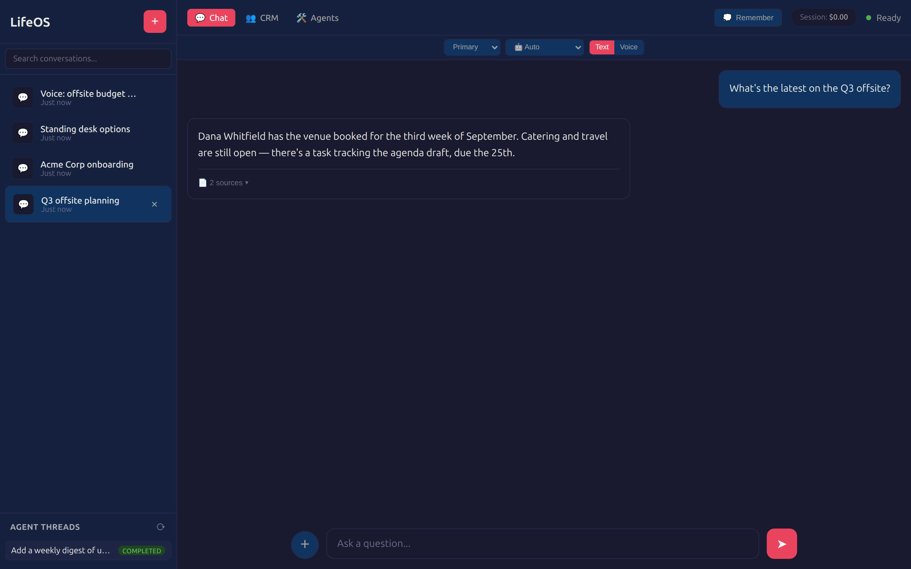
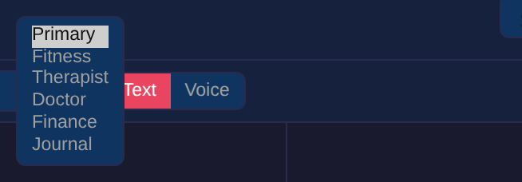
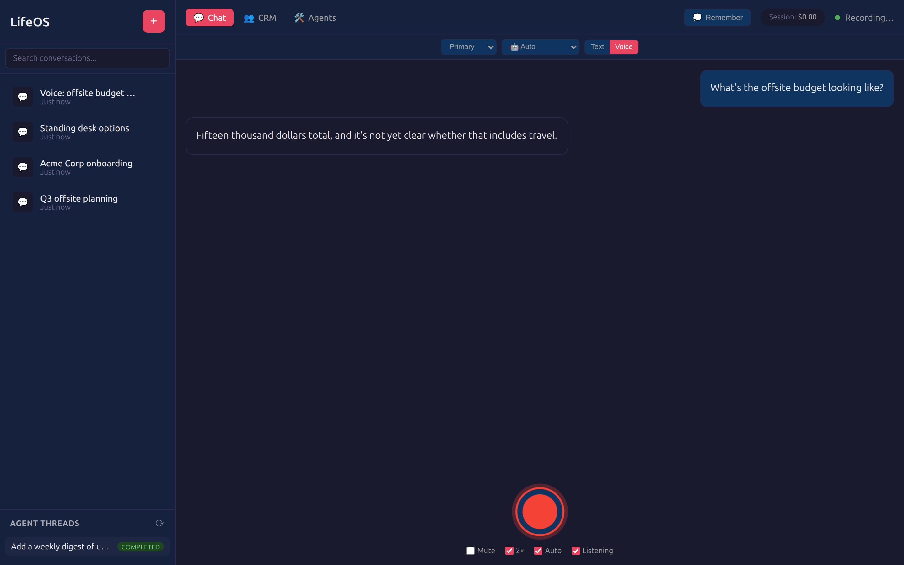
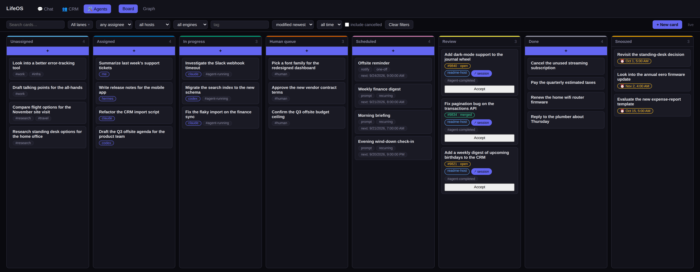
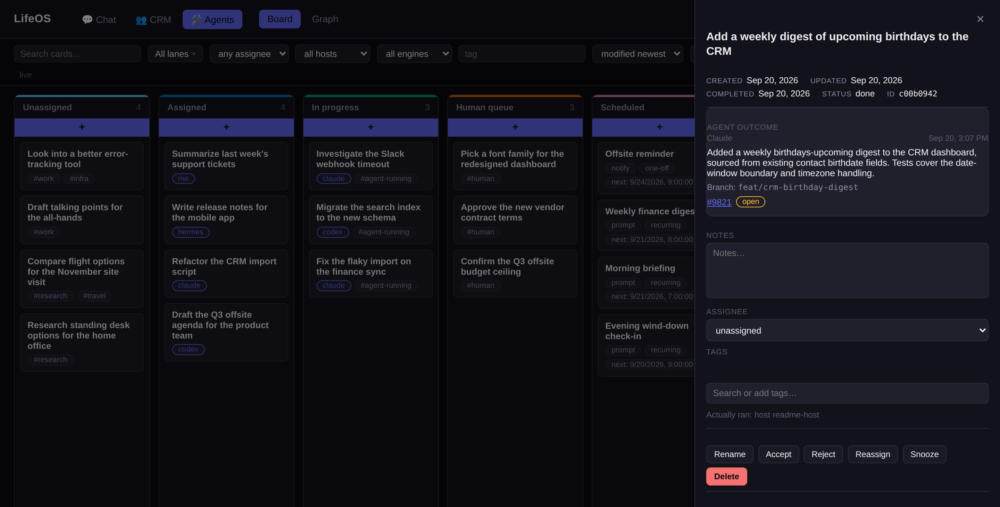
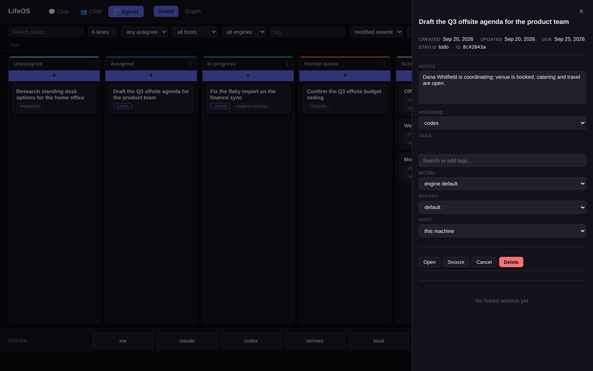
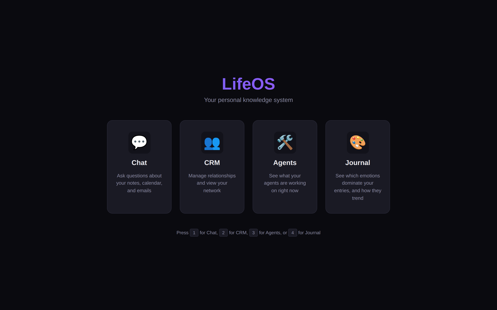
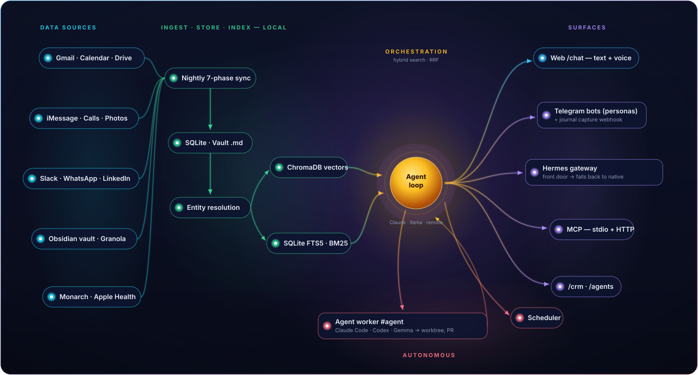
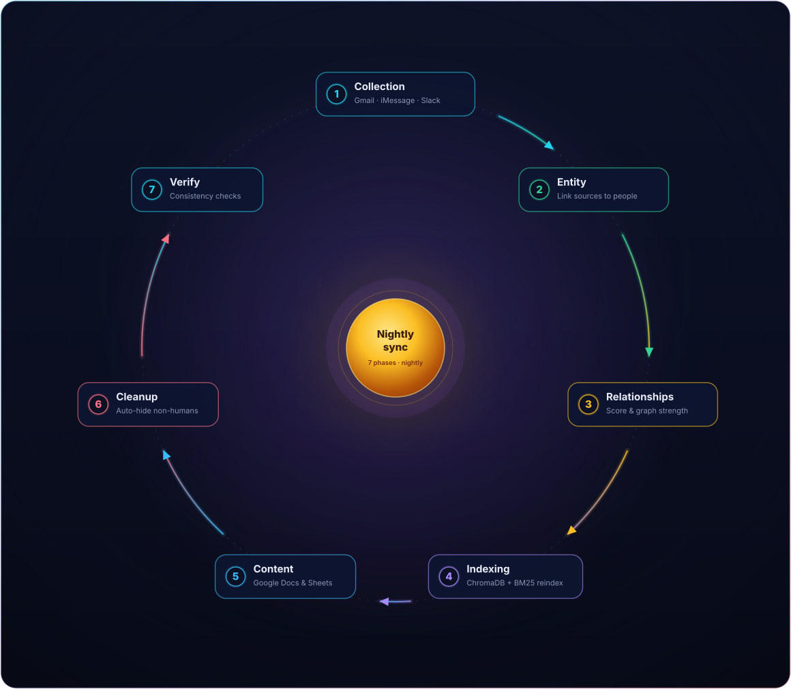
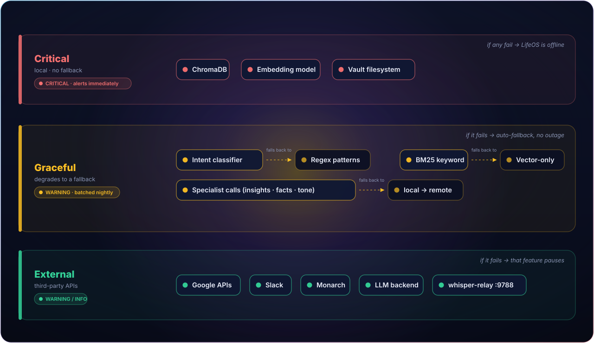

# LifeOS

**Your personal operating system, built from the digital exhaust of your life.**

LifeOS is a self-hosted AI assistant that connects to your Gmail, Google Calendar, Google Docs/Sheets/Drive, iMessage, phone calls, WhatsApp, Slack, Obsidian vault, Granola meeting transcripts, iPhotos, LinkedIn, Apple contacts, Monarch finances, and Apple Health — then makes all of it **available and actionable through natural language.**

**Front doors:** a web chat, Telegram, voice (wake word or push-to-talk, from a browser or an iOS Home Screen app), any MCP client (Claude Desktop, Claude Code), or a [Hermes](docs/specs/technical/client-surfaces.md) gateway that fronts your persona bots and falls back to LifeOS's native pipeline if Hermes is unreachable. It can answer from your data, take action on your behalf (draft email, schedule things, edit files), and hand long tasks to an autonomous agent that works while you don't — and reports back with a pull request when the work touches code.

All of your data is indexed and stored **locally** — your vault, messages, photos, financial summaries, and health data never leave your machine. By default, orchestration and synthesis call the Claude API (`LIFEOS_LLM_BACKEND=anthropic`, the default), which sends the current query and its retrieved context to Anthropic. For a no-API-key path, `LIFEOS_LLM_BACKEND=local` routes everything through a local llama-server on your own hardware, and `LIFEOS_LLM_BACKEND=remote` points at any OpenAI-compatible hosted provider (e.g. Fireworks) instead. A nightly sync pulls from your data sources, indexes everything for hybrid search (semantic + keyword), and keeps your relationship graph fresh.

> **New here?** Jump to [Quick Start](#quick-start), or the [Installation Guide](docs/guides/installation.md) for the full walkthrough (including a minimal "just an API key and a vault" path).

---

## What You Can Do

<details>
<summary><strong>Chat — ask across every source you're connected to, from one prompt</strong></summary>



Search and synthesize across notes, email, messages, calendar, docs, photos, and finances from a single question, on whichever surface fits the moment — web, Telegram, voice, or MCP — all sharing one stable [client contract](docs/specs/technical/client-surfaces.md).

- *"When did I last talk to Mom?"* / *"What's the context for my meeting with Acme Corp tomorrow?"* → quick answers and briefs, aggregating vault, calendar, email, and message history around a person or topic.
- *"What were the key recommendations Sarah made on the Acme project last month?"* → synthesized from hybrid semantic + keyword search across sources.
- *"What should I get Jane for her birthday?"* → pulls context from years of history to generate tailored ideas.

It also answers general-knowledge and web questions directly, and routes intelligently between your personal data, the web, and a stronger model when a query needs one. Tell it something once — *"remember Jonathan goes by Jon"* — and it recalls that fact in future conversations via the same hybrid recall it uses for everything else. Email always **drafts first** and requires an explicit, separate confirmation before anything sends, on every surface.

**Backends.** A per-conversation selector switches between three targets: **LifeOS** (native — full persona suite, per-turn model picker, and history LifeOS owns), **Agent** (a raw proxy to an external harness with no persona or model injection), and **Hermes** (keeps the persona picker but hands model choice to Hermes itself; conversations and usage are still tracked on the LifeOS side even though the reply comes from Hermes's backend). On the LifeOS backend, the per-turn model picker offers **Auto** (Haiku with automatic escalation), explicit **Sonnet** or **Opus**, local **Gemma**, your configured **Remote** provider, or a **Claude Code** handoff.

**Personas.** LifeOS ships six selectable personas — one assistant, different personalities and scopes. All but one keep the full tool suite; they differ in tone, what they draw on, and how they respond:

- **primary** — general-purpose default: concise, proactive.
- **therapist** — advice-oriented; draws on your own reflections and inner-circle context, with strict privacy rules.
- **fitness** — a log-first trainer: *"bench 135x8, then 5x5 squats @185"* is parsed and recorded (optionally mirrored to a Google Sheet), and *"what should I train today?"* answers from recent volume and recovery signals (sleep, resting HR, HRV, body weight) pulled from [Apple Health](docs/guides/apple-health.md).
- **finance** — a numbers-first planner grounded in your real Monarch portfolio: *"How much did I spend on restaurants last month?"* / *"Am I over budget on groceries?"* / *"What are my current investment holdings?"*
- **doctor** — repairs LifeOS itself (see [Autonomous agents & the board](#what-you-can-do)).
- **journal** — a narrow capture surface: a spoken or typed fragment is filed straight into your daily journal log through the same interpreter a [Pebble ring](#what-you-can-do) uses, without the general tool suite.

Pick a persona in `/chat`, or message its dedicated Telegram bot — they behave identically. Create your own with a markdown file. See the [Personas Guide](docs/guides/personas.md) and [Chat UI](docs/specs/product/chat-ui.md).



</details>

<details>
<summary><strong>Voice — talk to it, hear it back</strong></summary>



Tap to talk inside `/chat`, or leave it listening for a wake phrase — same personas, models, and conversations as text, spoken back to you. Setup: [Voice Guide](docs/guides/voice-setup.md).

Voice runs through the whisper-relay gateway: mic audio in, speech-to-text, the same orchestrator that answers a typed turn, text-to-speech, spoken reply out — reverse-proxied into `/chat` so the browser only ever talks to LifeOS's own origin. It works from an ordinary browser tab or as an installed iOS Home Screen app, each with its own mic-permission grant.

A voice turn is owned by the server the same way a text turn is: closing the app or losing the network mid-answer doesn't kill it — it keeps generating and the full reply is waiting when you reopen the conversation. Interrupting it is a real, explicit stop ("cancel", "never mind", "scratch that"), not just the phone walking away, so both "hang up without losing the answer" and "actually interrupt it" work at the same time.

</details>

<details>
<summary><strong>Autonomous agents & the board — hand off work, it comes back with a pull request</strong></summary>



Tag a task `#agent` and walk away. For anything that touches code, the session runs in its own isolated git worktree and branch, commits as it goes, and opens a pull request when it's done — the card lands in Review with the agent's own summary and a live PR badge. Watch everything on the [`/agents`](docs/specs/product/agent-viz.md) Kanban board.

```
- [ ] TODO Summarize my unread emails from the partnership channel and reply with the top 3 by importance #agent
- [ ] TODO Find every meeting where we discussed the Q3 launch and list attendees #agent #local
- [ ] TODO Draft a follow-up to last week's intro with Acme. Budget $0.25 #agent
```

- **Isolated by default.** A coding session never runs in your primary checkout. It's provisioned a deterministic sibling worktree and a conventionally-named branch (`feat/`, `fix/`, `docs/`, …) off the default branch before it starts; if it leaves anything uncommitted when it stops, the worker commits and pushes that too, then opens (or reuses) a pull request against the base branch. A failed push or an unreachable host is reported in plain text, never silently swallowed.
- **The board is the queue.** Lanes — Unassigned, Assigned, In progress, Human queue, Scheduled, Review, Done, Snoozed — are derived live from your task store, not a separate board file. A Review card shows which engine ran it, its own completion summary, and the branch and PR it opened, with the merge-status badge refreshing roughly every 30 seconds.
- **Asks when genuinely stuck, resumes where it left off.** A session that hits a real ambiguity pauses in the Human queue lane instead of guessing. Reply on Telegram — the message is threaded to that card and prefixed with the card's own title so concurrent sessions stay attributable — and the session resumes **in the exact same worktree and branch**, with your note folded onto the next turn. No answer within the configured window (72 hours by default) and the task is parked with a heads-up instead of abandoned.
- **Snoozed cards wake themselves up.** Push a card's wake time out and it drops out of the active lanes; when that time passes, it returns to its natural lane and sends a Telegram notification naming the card.
- **Cleanup is automatic.** Each session gets a private scratch directory that's removed the moment it reaches a terminal state; a worktree is removed only once its session is done *and* its PR is merged, its card accepted, or its card cancelled — orphaned worktrees are swept up the same way. Nothing is cleaned up until it's genuinely safe to.
- **Choose your engine.** `#local` runs on your self-hosted Gemma — free, private. `#cloud` runs on your configured `LIFEOS_REMOTE_LLM_*` provider (e.g. Fireworks). `#cloud-haiku` / `#cloud-sonnet` route to Anthropic's [Managed Agents](docs/specs/product/agent-worker.md) with Gmail / Calendar / Drive / Slack / Asana / Ramp connectors out of the box. `#claude` and `#codex` hand off to those CLI engines directly. `#hermes` routes through your Hermes gateway, reporting progress in its own Telegram DM instead of your primary bot. No tag, and the agent infers from the title.
- **Budgets in the title.** *"max $0.50"*, *"5 min"*, *"10k tokens"* — parsed in natural language, enforced from outside the agent loop, with a global daily $-ceiling backstop.
- **Fully audited and restart-safe.** Every tool call, model turn, and cost delta is captured; a crash mid-task rolls back to `#agent` for retry, or resumes a still-running cloud session where it left off.
- **Spawns its own teammates.** Agents can spawn child sessions, message them, and yield until they finish — good for fan-out research and parallel pipelines.

You can also run terminal, filesystem, and code tasks directly through **Claude Code** or **Codex** — via `/claude` / `/codex` on Telegram, "use claude code" in chat, or the `/chat` model picker (see [Claude Code / Codex orchestration](docs/specs/product/claude-code-orchestration.md)) — with the same escalation ladder available inline: *"escalate to opus"* / *"use sonnet"* runs that turn on the named model, and a wrongly-refused turn you push back on climbs automatically through Claude Code, then Codex — never to a metered API model without you asking for it.

**Hermes** is an external agent harness that can front your Telegram persona bots: it resolves a persona's preamble from LifeOS and runs its own backend model, `@persona`-tags and reply-thread inheritance route a DM to the right assistant, and LifeOS still owns the resulting conversation history and usage/cost even though the model call happened elsewhere. If Hermes is unset or unreachable for a turn, the request falls back to LifeOS's native pipeline and says so, once, in-channel.

**Self-repair: the doctor bot.** When LifeOS itself misbehaves or is missing a capability, you don't file a bug — you tell the **doctor bot**. It talks through the goal with you, gets your one approval, then autonomously files a GitHub issue, ships a tested pull request (branch → review → merge), verifies the deploy landed, and reports back with a one-line revert handle if you want to undo it. See the [Doctor Bot Guide](docs/guides/doctor-bot.md).



Set up: [Agent Worker Setup](docs/guides/agent-worker-setup.md). Full reference: [Product](docs/specs/product/agent-worker.md) · [Technical](docs/specs/technical/agent-worker.md) · [Human Queue](docs/guides/human-queue.md).

</details>

<details>
<summary><strong>Task management — tasks, reminders, and schedules, steerable in plain language</strong></summary>



Tasks and reminders live in your vault as plain markdown, and every recurring or one-off automation runs on one scheduler.

- *"Next Wednesday I need to pull down my 1099 from Schwab"* → a [task](docs/specs/product/task-management.md), filed to your Inbox. Any hand-written checklist item in your vault is picked up as a task on the next reindex — you don't have to go through chat to create one.
- *"Remind me to follow up with John next Tuesday"* → delivered on Telegram at the right time. A reminder is just a schedule whose action sends a fixed message — there's no separate reminder system to think about.
- *"Every weekday at 9am, brief me on my calendar"* / *"Every Saturday at 9am, have the cloud agent draft my weekly review"* → a recurring **schedule**.

A schedule's trigger (cron or one-off) fires one of four actions: **notify** (send a fixed message), **prompt** (run an LLM prompt and send the result), **endpoint** (call an internal API and send the formatted result), or **agent** (hand the work to the autonomous agent, tagged for whichever engine you choose). Empty results stay silent, so a high-frequency check doesn't become noise. See the [Scheduler Guide](docs/guides/scheduler.md).

The system doesn't just wait for you to ask, either — before meetings it pushes a prep briefing with CRM context, each morning it summarizes your calendar/tasks/important email, and weekly it flags people you've fallen out of touch with. These are seedable schedule entries you can edit, extend, or add your own to.

</details>

<details>
<summary><strong>CRM — turn years of interaction history into relationship insight</strong></summary>


A ranked, searchable directory of everyone you've emailed, texted, or met — with per-person pages, a cross-source timeline, and a force-directed relationship graph. Browse it at [`/crm`](docs/specs/product/crm-ui.md).

*"Who am I engaging with less these days? Who should I reconnect with?"* — interaction history, communication patterns, and relationship strength over time, computed from what you've already done, not anything you had to type in.

- [Per-person pages](docs/specs/product/crm-people.md) aggregate contact details, sources, stats, and facts extracted from your conversations, with split/merge and link-override controls when entity resolution needs a correction.
- A [chronological timeline](docs/specs/product/crm-interactions.md) across every source — email, calendar, iMessage, Slack, WhatsApp — shows how a relationship has actually evolved.
- A force-directed [relationship graph](docs/specs/product/crm-graph.md) lets you explore your network visually, filterable by source.
- [Analytics dashboards](docs/specs/product/crm-analytics.md) — **Family**, **Me** (network health), **Birthdays**, and a **Relationship** dashboard for a designated partner, including tone analysis over your message history and, for the therapist persona, insight drawn from your own reflections.

<strong>Per-person pages aggregating contact details and interaction history.</strong>


<strong>See how your communication patterns have evolved over the years.</strong>


<strong>Go deeper on your relationships with family and a designated partner.</strong>


<strong>Explore your relationships in a dynamic social graph.</strong>


</details>

<details>
<summary><strong>Data processing — sources, nightly sync, hybrid search, entity resolution</strong></summary>



Everything above is built on a nightly sync that pulls from every connected source, resolves who's who across them, and indexes it all for search that understands both meaning and keywords.

| Source | Method | Data |
|--------|--------|------|
| Obsidian | File watcher | Notes, mentions |
| Gmail (personal + work) | Google API | Emails, threads |
| Calendar (personal + work) | Google API | Events, attendees |
| Google Docs / Sheets | Google API | Document + tabular content |
| Google Drive | Google API | File search / content |
| iMessage / SMS | Apple Data Agent | Messages |
| Phone calls | Apple Data Agent | Call history |
| Contacts | Apple Data Agent | Names, emails, phones, birthdays |
| Photos | Apple Data Agent | Face recognition |
| WhatsApp | wacli → Apple Data Agent | Chat history |
| Slack | Slack API | DMs, channels, users |
| LinkedIn | CSV import, plus optional browser-automated profile enrichment | Connections, roles, education |
| Monarch | Monarch API | Accounts, transactions, holdings |
| Apple Health | HealthBridge app / iOS Shortcut | Workouts, sleep, HR, HRV, weight |
| Granola | Vault file | Meeting transcripts |

- **Entity resolution** links every identifier — an email address, a phone number, "John from the conference" — to one canonical [PersonEntity](docs/specs/product/data-model.md), matching on exact email or phone first and falling back to fuzzy, nickname-aware name matching with relationship-strength-informed disambiguation when two candidates are close. See [Entity Resolution](docs/specs/product/entity-resolution.md).
- **Hybrid search** fuses ChromaDB vector similarity with SQLite FTS5/BM25 keyword search via Reciprocal Rank Fusion, then re-ranks the fused results with a cross-encoder — while protecting a precise factual match from being displaced by something merely "more semantically similar." See [Search & Indexing](docs/specs/technical/search-indexing.md).
- **Nightly sync** runs in seven dependency-ordered phases: Collection, Entity Processing, Relationship Building, Vector Store Indexing, Content Sync, Post-Sync Cleanup, and Consistency Verification — see [System architecture](#what-you-can-do) for the diagram and [Data & Sync](docs/specs/technical/data-and-sync.md) for the full pipeline.
- **Capture from a Pebble Index ring.** Speak into it and it transcribes on-phone, then posts the fragment straight into LifeOS through the same interpreter a typed journal message goes through — same log file, same task/schedule-extraction judgment. An optional filing pipeline can additionally turn a fragment into a task, a reminder, or a scheduled agent hand-off, but only on explicit, unambiguous delegation language — never from an offhand remark. See the [Journal Ring Ingest Guide](docs/guides/journal-ring-ingest.md) and [Pebble Capture Guide](docs/guides/pebble-capture.md).
- **Journal trends.** A logging-consistency heatmap, an emotion-vocabulary view of what you never reach for, and mood/stress/sleep correlations — read entirely from your vault, outside the CRM's entity model. See [Journal Analytics](docs/specs/product/journal-analytics.md).


</details>

<details>
<summary><strong>System architecture — the diagrams</strong></summary>

Data flows from your sources, through local storage and indexing, into an orchestrator that answers queries and drives autonomous work across every surface:

<p align="center">
  
</p>

### Query pipeline

Most queries go straight to the orchestrator, which decides — over multiple rounds of tool calls — what to search and how to answer:

<p align="center">
  
</p>

The orchestrator defaults to Claude via the Anthropic API (`LIFEOS_LLM_BACKEND=anthropic`, model from `LIFEOS_ANTHROPIC_MODEL`); set `LIFEOS_LLM_BACKEND=local` to route through a local llama-server, or `LIFEOS_LLM_BACKEND=remote` to route through a hosted OpenAI-compatible provider instead. Internals: [Search & Indexing](docs/specs/technical/search-indexing.md) · [Architecture](docs/specs/technical/architecture.md).

### Sync cycle

<p align="center">
  
</p>

### Service dependencies

Services are categorized by criticality and fallback behavior:

<p align="center">
  
</p>

**Alert severities:** CRITICAL (sent immediately — ChromaDB down, embedding failed, vault inaccessible) · WARNING (batched nightly — LLM API errors, backup failed) · INFO (log only). See [Operations](docs/guides/operations.md).

### Agent lifecycle

How a board card becomes a pull request:

<p align="center">
  
</p>

</details>

<details>
<summary><strong>Privacy & self-hosting — what stays local, what leaves, and your call on backends</strong></summary>

<p align="center">
  
</p>

Everything LifeOS learns about you — indexed content, the CRM graph, sync state, OAuth tokens, financial summaries, health data — is stored locally in SQLite and ChromaDB, on disk, on your machine. There's no telemetry, no analytics, and no bulk export API.

The only thing that ever leaves is a **per-query payload**: the current turn's query text plus whatever context the agent decided to retrieve, sent to whichever LLM backend you've configured — Anthropic by default (`LIFEOS_LLM_BACKEND=anthropic`), a local llama-server on your own hardware (`LIFEOS_LLM_BACKEND=local`), or any OpenAI-compatible hosted provider such as Fireworks (`LIFEOS_LLM_BACKEND=remote`). Specialist calls — relationship insights, fact extraction, tone analysis — fall back the same way: Anthropic if you have a key, otherwise a local model, otherwise your configured remote provider, never erroring out on a keyless install. See [Security & Privacy](docs/specs/technical/security-privacy.md), [LLM options](#llm-options), [ADR-024](docs/adr/024-remote-llm-backend.md), and [ADR-025](docs/adr/025-specialist-call-fallback.md).

Two egress paths are opt-in and off by default, each requiring an explicit `.env` setting: Anthropic's [Managed Agents](docs/specs/product/agent-worker.md) cloud routing (`#cloud-haiku` / `#cloud-sonnet` task tags), which sends a task to Anthropic's hosted agent sandbox with its own Gmail/Calendar/Drive/Slack/Asana/Ramp connectors; and a Hermes or Agent HTTP backend, which proxies a turn to an external harness you point it at.

**API spend requires consent.** Automatic escalation only ever climbs to engines that cost nothing per token — local Gemma, Claude Code, Codex. Reaching a metered API model always takes an explicit ask: a `#cloud-haiku`/`#cloud-sonnet` tag, a model-picker choice, or telling it to escalate. A spawned Claude Code or Codex CLI session has Anthropic credentials stripped from its environment so it can never accidentally bill your API key. See [ADR-018](docs/adr/018-api-spend-requires-consent.md).

**Self-hosting** means your own hardware, your own systemd (Linux) or launchd (macOS) services, your own vault path, and a local API with no auth by design — it's meant for a single user, reachable remotely only over something like Tailscale. Someone other than the maintainer can also run LifeOS config-only, pointed at their own vault and credentials, talking to it through an external Hermes front door instead of running their own sync — see [Setting up for a second user](docs/guides/installation.md#setting-up-for-a-second-user-config-only).

</details>

---

## Requirements

- **Linux** (primary) or **macOS**
- **Python 3.11+**
- **ChromaDB** (installed via `pip`; the only hard external service)
- An **Obsidian vault** (or any folder of markdown notes)
- **A Claude API key** on the default backend — *or* a **GPU** (AMD ROCm / NVIDIA CUDA) to run everything locally — *or* an API key for any OpenAI-compatible hosted provider (e.g. Fireworks), for a no-local-GPU / no-Anthropic-key path

macOS is only required for native Apple integrations (iMessage, calls, Contacts, Photos) — LifeOS itself, including the local LLM, runs the same on macOS as on Linux, with `setup-launchd.sh` standing in for `setup-systemd.sh`. A Mac can also act as an [Apple Data Agent](docs/guides/operations.md) satellite, exporting Apple data nightly to a Linux host. Someone other than the maintainer can also install LifeOS config-only, talking to it through an external Hermes front door instead of running their own sync — see [Setting up for a second user](docs/guides/installation.md#setting-up-for-a-second-user-config-only).

### LLM options

Orchestration and synthesis run against the Claude API (default), a local OpenAI-compatible llama-server, or a hosted OpenAI-compatible provider. Pick what matches your hardware, budget, and privacy posture:

| Hardware / preference | Config | Notes |
|----------------------|--------|-------|
| No GPU / prefer cloud (default) | `LIFEOS_LLM_BACKEND=anthropic` + `ANTHROPIC_API_KEY` | Default model `claude-haiku-4-5` (override via `LIFEOS_ANTHROPIC_MODEL`). Query text + retrieved context is sent to Anthropic. |
| No GPU, no Anthropic key | `LIFEOS_LLM_BACKEND=remote` + `LIFEOS_REMOTE_LLM_URL`/`_MODEL`/`_API_KEY` | Any OpenAI-compatible endpoint (e.g. Fireworks). Query text + retrieved context is sent to that provider. |
| 8 GB RAM | `LIFEOS_LLM_BACKEND=local` + a small (~7B) model | Set `LIFEOS_LOCAL_LLM_URL` if not on `localhost:8080`. |
| 16–32 GB RAM | `LIFEOS_LLM_BACKEND=local` + a medium (~14–32B) model | |
| 64 GB+ VRAM | `LIFEOS_LLM_BACKEND=local` + a large (70–120B) model | Default local model: `unsloth/gemma-4-26B-A4B-it-GGUF`. |

To stay fully local, set `LIFEOS_LLM_BACKEND=local` and point `LIFEOS_LOCAL_LLM_URL` at a running llama-server. See the [Configuration Guide](docs/guides/configuration.md).

`LIFEOS_ANTHROPIC_MODEL` is the **base** orchestrator model. On top of it, per-query **escalation** (Anthropic backend only, off unless `LIFEOS_AGENT_ESCALATION_MODEL` is set) lets a turn run on a stronger model or hand off to a CLI engine:

- **User-directed:** *"escalate to opus"* / *"use sonnet"* runs that turn on the named model; *"use codex"* / *"use claude code"* hands off to that CLI worker.
- **Automatic:** when a turn wrongly refuses and you push back, LifeOS climbs to Claude Code, then — on a second push — to Codex. Automatic escalation only ever reaches engines that cost nothing per token (`claude_code`, `codex`, `local`); a stronger *API* model is something you ask for, never something LifeOS picks for you. `LIFEOS_AGENT_ESCALATION_MODEL` switches escalation on; `LIFEOS_AGENT_ESCALATION_LADDER` tunes the rungs.

---

## Quick Start

The minimal setup is an LLM credential and a folder of notes — everything else (Google, Slack, Telegram, Apple, voice, finances) is optional and layered on later. Two no-GPU paths:

```bash
# 1. Clone and install
git clone <your-fork-url> LifeOS
cd LifeOS
python3 -m venv ~/.venvs/lifeos
source ~/.venvs/lifeos/bin/activate
pip install -r requirements.txt

# 2. Configure
cp .env.example .env
# Edit .env — minimal required:
#   LIFEOS_VAULT_PATH   → your Obsidian/markdown folder
#
# Path A — Claude API key (default backend):
#   ANTHROPIC_API_KEY   → your Claude API key
#
# Path B — no Claude key, use any OpenAI-compatible hosted provider (e.g. Fireworks):
#   LIFEOS_LLM_BACKEND=remote
#   LIFEOS_REMOTE_LLM_URL, LIFEOS_REMOTE_LLM_MODEL, LIFEOS_REMOTE_LLM_API_KEY
#
# (or LIFEOS_LLM_BACKEND=local with a running llama-server on LIFEOS_LOCAL_LLM_URL,
# if you'd rather run inference on your own GPU)

# 3. Start the vector DB + server
./scripts/chromadb.sh start
./scripts/server.sh start

# 4. Open the app
#   http://localhost:8000/chat
```

For services that persist across reboots on Linux, run `sudo ./scripts/setup-systemd.sh` to install systemd units (macOS: `./scripts/setup-launchd.sh`).

After the first sync, `scripts/setup_identity.py` walks you through telling LifeOS who you are (guided, replaces hand-editing `.env`/`config/family_members.json`), and `scripts/first_backfill.py` runs a one-time deep backfill beyond the nightly sync's narrower lookback window — see [First Run](docs/guides/first-run.md).

Full walkthrough (including which external accounts each integration needs): [Installation Guide](docs/guides/installation.md).

---

## Tech Stack

| Component | Technology |
|-----------|------------|
| Backend | FastAPI (port 8000) |
| LLM (orchestration + synthesis) | Claude via Anthropic API (default; `LIFEOS_ANTHROPIC_MODEL`, defaults to `claude-haiku-4-5`), a local llama.cpp server (`LIFEOS_LLM_BACKEND=local`), or any hosted OpenAI-compatible provider such as Fireworks (`LIFEOS_LLM_BACKEND=remote`) |
| Embeddings | sentence-transformers (`mxbai-embed-large-v1` by default; `gte-Qwen2-1.5B-instruct` is a supported upgrade) |
| Vector DB | ChromaDB (port 8001) |
| Keyword Search | SQLite FTS5 (BM25) |
| Intent classifier | Claude Haiku (Anthropic API), with a regex-pattern fallback |
| Voice | whisper-relay gateway (STT → orchestrator → TTS), reverse-proxied into `/chat` |
| Frontend | Vanilla HTML/JS (no build step) |
| Job Queue | SQLite (background reindex, sync) |
| Scheduler | Markdown source of truth + rebuildable index; 60s cron tick |
| Service Management | systemd (Linux) / launchd (macOS) |
| GPU Acceleration | ROCm (AMD) or CUDA (NVIDIA) |

---

## Documentation

### Getting started
- [Installation](docs/guides/installation.md) · [Configuration](docs/guides/configuration.md) · [First Run](docs/guides/first-run.md)
- [Google OAuth](docs/guides/google-oauth.md) · [Telegram](docs/guides/telegram-setup.md) · [Voice](docs/guides/voice-setup.md) · [Slack](docs/guides/slack-integration.md)
- [Personas](docs/guides/personas.md) · [Scheduler](docs/guides/scheduler.md) · [Apple Health](docs/guides/apple-health.md)
- [Agent Worker Setup](docs/guides/agent-worker-setup.md) · [Doctor Bot](docs/guides/doctor-bot.md) · [Human Queue](docs/guides/human-queue.md) · [Operations](docs/guides/operations.md) · [Troubleshooting](docs/guides/troubleshooting.md)
- [Journal Ring Ingest](docs/guides/journal-ring-ingest.md) · [Pebble Capture](docs/guides/pebble-capture.md)

### Product specs
- [Chat UI](docs/specs/product/chat-ui.md) · [CRM UI](docs/specs/product/crm-ui.md) · [CRM Analytics](docs/specs/product/crm-analytics.md)
- [Agent Worker](docs/specs/product/agent-worker.md) · [Agent Viz (`/agents`)](docs/specs/product/agent-viz.md) · [Claude Code / Codex](docs/specs/product/claude-code-orchestration.md)
- [MCP Tools](docs/specs/product/mcp-tools.md) · [Task Management](docs/specs/product/task-management.md) · [Data Model](docs/specs/product/data-model.md) · [Entity Resolution](docs/specs/product/entity-resolution.md) · [Journal Analytics](docs/specs/product/journal-analytics.md) · [API Reference](docs/specs/product/api-reference.md)

### Technical specs
- [Architecture](docs/specs/technical/architecture.md) · [Client Surfaces](docs/specs/technical/client-surfaces.md) · [Data & Sync](docs/specs/technical/data-and-sync.md)
- [Search & Indexing](docs/specs/technical/search-indexing.md) · [Agent Worker (Technical)](docs/specs/technical/agent-worker.md) · [Security & Privacy](docs/specs/technical/security-privacy.md)

### Architecture decisions
- [ADR Index](docs/adr/) — why Python/FastAPI, ChromaDB, hybrid search, local-first, and more

---

## Contributing

See [CONTRIBUTING.md](CONTRIBUTING.md) for guidelines.

---

## License

GNU General Public License v3.0 — see [LICENSE](LICENSE).

Third-party material redistributed here (currently the Apache-2.0 nickname dataset) is recorded in
[THIRD_PARTY_NOTICES.md](THIRD_PARTY_NOTICES.md).
